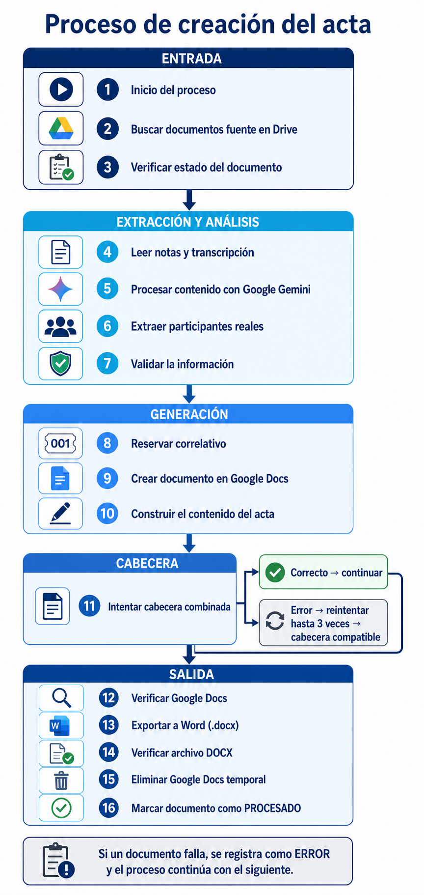

# ActasReunionIA

Automatización de actas institucionales a partir de notas creadas por Gemini
en Google Meet. El sistema utiliza Google Apps Script para coordinar Google
Drive, Google Docs, Google Sheets y la API de OpenAI, y produce un archivo
Microsoft Word verificable.

## Capacidades principales

- Localiza notas elegibles en una carpeta configurada de Google Drive.
- Evita reprocesar documentos mediante su identificador estable de Drive.
- Lee las notas y la transcripción vinculada a la reunión.
- Extrae participantes confirmados sin incorporar personas solo mencionadas.
- Estructura el contenido del acta mediante una respuesta JSON validada.
- Genera la cabecera y las secciones de la plantilla institucional.
- Construye `Temas tratados` desde el resumen y el contenido de sus subtítulos.
- Administra correlativos con bloqueo para impedir asignaciones concurrentes.
- Exporta, verifica y almacena el resultado como archivo `.docx`.
- Elimina permanentemente el Google Docs temporal después de verificar Word.
- Registra cada fuente como `PROCESADO` o `ERROR` sin detener los candidatos
  siguientes.

El nombre del entregable conserva el formato:

```text
DD.MM.AAAA-NNN-Daily.docx
`## Flujo general

```text
Nota de Gemini + transcripción
              │
              ▼
  Selección y control de estado
              │
              ▼
  Extracción y análisis con Google Gemini (GeminiIA)
              │
              ▼
  Validación y reserva de correlativo
              │
              ▼
    Generación del Google Docs
              │
              ▼
     Exportación y verificación DOCX
              │
              ▼
  Registro final y eliminación temporal
```

Un error individual se registra y el procesamiento continúa con el siguiente
documento candidato.

### Proceso de creación del acta



La infografía representa el flujo desplegado en el entorno experimental:
Google Gemini realiza la estructuración principal del contenido antes de la
validación y la generación documental.

## Aplicación web administrativa

La aplicación web, restringida mediante una lista de correos autorizados,
ofrece dos vistas:

- **Notas de Reuniones por MEET:** muestra hasta diez notas recientes,
  ordenadas por fecha de creación, y permite generar el acta seleccionada.
- **Mantenimiento del Correlativo Daily:** permite consultar y ajustar de forma
  controlada el último correlativo persistido.

Después de seleccionar una reunión, la vista permite revisar y editar antes de
generar el acta:

- Hora de inicio, inicialmente `09:00 AM`.
- Hora de fin, inicialmente `09:20 AM`.
- Agenda, inicialmente `Reunión`.
- Próxima reunión, inicialmente vacía.

Estos valores se envían al backend y prevalecen en el documento generado. La
vista no calcula horarios ni próxima reunión con reglas Daily; una próxima
reunión vacía permanece vacía.

La vista publicada de esta línea independiente está disponible en:

`https://script.google.com/macros/s/AKfycbw2-H74M7V7lRri9EC1yehucw-Z-3Z7wxr4IpcKJjJk-lxHxz-3Q08SE4306SEqhiQ/exec?vista=notas`

Su encabezado visible es **Notas de Reuniones por MEET**. La implementación
versionada `4` y el Script ID pertenecen exclusivamente a
`ActasReunion2IA_G`.

Al seleccionar una reunión, la interfaz muestra únicamente su día y hora de
creación. El identificador de Drive se conserva en memoria para la operación,
pero no aparece en la página.

Desde la vista de notas existen dos modos de generación:

- **Crear Acta:** reserva y actualiza el correlativo automático.
- **Crear Acta SEC.:** usa exactamente el número de secuencia indicado sin
  modificar el correlativo global.

Después de una generación correcta se habilita una descarga protegida mediante
un token temporal de un solo uso. El ID del archivo y las credenciales no se
exponen en la URL.

## Arquitectura del repositorio

```text
ActasReunionIA/
├── AppsScript/       Código de Google Apps Script y aplicación web
├── Configuracion/    Catálogo y guía de propiedades
├── Documentacion/    Arquitectura, flujo, decisiones y riesgos
├── Plantillas/       Referencias de la plantilla institucional
├── Prompts/          Documentación del contrato de extracción
├── Pruebas/          Pruebas automatizadas ejecutables con Node.js
├── Recursos/         Recursos gráficos y auxiliares autorizados
├── Scripts/          Utilidades de desarrollo y despliegue
├── docs/             Bitácora técnica acumulativa
├── .github/          Configuración de GitHub
├── AGENTS.md         Reglas permanentes de colaboración
└── README.md
```

Los documentos generados y las notas reales no se almacenan en Git.

## Módulos principales

| Módulo | Responsabilidad |
|---|---|
| `Main.gs` | Orquestación secuencial y consolidación del resultado |
| `Config.gs` | Lectura y validación de propiedades |
| `Drive.gs` | Acceso a notas, transcripciones y metadatos de Drive |
| `Procesados.gs` | Estados, unicidad e idempotencia en Google Sheets |
| `Correlativo.gs` | Reserva persistente protegida por bloqueo |
| `Prompt.gs` | Construcción de instrucciones para la IA |
| `GeminiIA.gs` | Integración con la API de Google Gemini y esquema JSON estructurado |
| `OpenAI.gs` | Cliente secundario de respaldo con la API de OpenAI |
| `ValidadorRespuesta.gs` | Validación y normalización del acta estructurada |
| `Personas.gs` | Resolución de participantes, cargos y unidades |
| `Acta.gs` | Construcción y formato del documento institucional |
| `Word.gs` | Exportación, verificación DOCX y eliminación temporal |
| `Web/` | Consulta de notas, generación dirigida y mantenimiento |

## Configuración

Los valores operativos se administran mediante **Script Properties**; nunca
deben incorporarse al repositorio. Entre las propiedades utilizadas se
encuentran:

- `CARPETA_NOTAS_GEMINI_ID`
- `PLANTILLA_ACTA_ID`
- `CARPETA_OTRO`
- `CARPETA_RAIZ_ACTAS_ID`
- `REPOSITORIO_PROCESADOS_ID`
- `ACTA_CODIGO_FORMATO` (obligatoria; código visible de la cabecera)
- `ACTA_CELULA` (obligatoria; sufijo del identificador de reunión)
- `ACTA_AGENDA_FIJA` (opcional; contenido posterior a `Dayli –`)
- `GEMINI_API_KEY`
- `GEMINI_MODELO` (predeterminado: `gemini-2.0-flash`)
- `OPENAI_API_KEY` (opcional / respaldo)
- `PROMPT_VERSION`
- `MANTENIMIENTO_CORREOS_AUTORIZADOS`
- `ACTAS_ULTIMO_CORRELATIVO`

Consulta la documentación técnica antes de preparar un entorno. La carpeta
`Configuracion/` está reservada para material de configuración autorizado, sin
valores operativos ni secretos.

## Pruebas

Las pruebas unitarias se ejecutan con Node.js, sin realizar llamadas reales a
OpenAI ni procesar reuniones reales:

```powershell
Get-ChildItem .\Pruebas -Filter *.test.js |
  Sort-Object Name |
  ForEach-Object { node $_.FullName }
```

La suite cubre, entre otros aspectos, cabecera, agenda, temas tratados,
acuerdos, participantes, disponibilidad, generación dirigida, mantenimiento y
exportación Word.

## Seguridad y privacidad

- No se almacenan claves, tokens ni identificadores operativos en Git.
- Los registros omiten el contenido completo de las reuniones y los prompts.
- La aplicación web deniega por defecto las cuentas no autorizadas.
- Los entregables no se versionan en el repositorio.
- Las llamadas reales a OpenAI requieren autorización y configuración externa.

## Documentación técnica

- [Arquitectura](Documentacion/Arquitectura.md)
- [Flujo de procesamiento](Documentacion/Flujo_Procesamiento.md)
- [Decisiones arquitectónicas](Documentacion/Decisiones_Arquitectonicas.md)
- [Riesgos técnicos](Documentacion/Riesgos_Tecnicos.md)
- [Estructura del proyecto](Documentacion/Estructura_Proyecto.md)
- [Bitácora de cambios](docs/CODEX_BITACORA.md)

## Estado

| Aspecto | Detalle |
|---|---|
| **Rama activa de desarrollo** | `ActasReunion2IA_G` |
| **Rama estable** | `main` |
| **IA principal** | Google Gemini (`GeminiIA.gs`) |
| **IA secundaria / respaldo** | OpenAI (`OpenAI.gs`) — opcional |
| **Despliegue** | Google Apps Script vía `clasp` |
| **Flujo** | Nuevo modelo funcional orientado a reuniones que no son Daily |

La rama `ActasReunion2IA_G` constituye un nuevo modelo orientado a generar
actas de reuniones que no corresponden a sesiones Daily. Conserva Google
Gemini como motor principal de análisis y mantiene una implementación web y un
proyecto Apps Script independientes. No se fusionará con `main` ni con
`ActasReuIA_GEMI` sin aprobación explícita.

No se declara una versión semántica formal hasta que exista una publicación
aprobada.

## Línea independiente ActasReunion2IA_G

Esta copia conserva el código, historial y arquitectura de la variante Google
Gemini de origen:

- Fecha de creación: `2026-08-11`.
- Proyecto de origen: `ActasReunionIA_G`.
- Rama de origen: `ActasReuIA_GEMI`.
- Commit de origen: `5270cf7`.
- Carpeta local: `ActasReunion2IA_G`.
- Rama Git: `ActasReunion2IA_G`.
- Proyecto Apps Script: `ActasReunion2IA_G`.
- Script ID: `11nqac…Hbc7q`.

La nueva línea no comparte proyecto Apps Script con `ActasReunionIA` ni con
`ActasReunionIA_G`. No debe fusionarse con otras ramas sin autorización
explícita.

`.clasp.json` es una asociación local del entorno y no se versiona porque
contiene el identificador operativo del proyecto Apps Script.

El acceso administrativo se concede mediante la propiedad segura
`MANTENIMIENTO_CORREOS_AUTORIZADOS`. Los correos autorizados se configuran
directamente en Apps Script y no se almacenan en Git.

## Licencia

Pendiente de definición.
